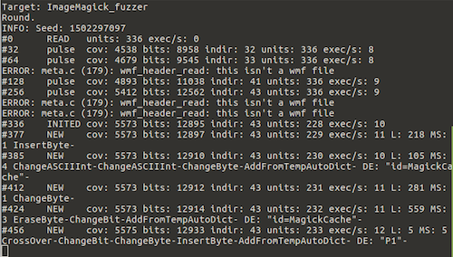

# libfuzzerfication

# Synopsis
Fuzz-testing is software design technique that involves providing random data to the inputs of a computer program. The program

Purpose is to make it easy to find vulnerabilities from commonly used libraries. We have list of top 50 most used libraries from Protecode SC.

Currently our top targets are:
* libxslt
* speex
* libflac
* gstreamer

Google cloud is going to be used for scale.

You're welcome to collaborate!

This is part of [OUSPG-open](https://github.com/ouspg/ouspg-open)

# Motivation
There have been lots of vulnerabilities in popular libraries that should have been (theoretically) easy to test. We want to offer easy way to fuzz-test these libraries and increase awareness about the situation. We also want this to be available to everyone.

# How does it work?
* Pull container from Dockerhub
* Write your own libfuzzer stub
* Share dockerfile with other users
* Use libFuzzer to collect corpus so that other people can continue where you left off

# To whom is this?
* library developers
* users

# Material

* [libFuzzer](http://llvm.org/docs/LibFuzzer.html)
* [SanitizerCoverage](http://clang.llvm.org/docs/SanitizerCoverage.html)
* You can find some nice examples from: [libfuzzer-bot repo](https://github.com/google/libfuzzer-bot)
* [libFuzzer in Chrome](https://chromium.googlesource.com/chromium/src/+/master/testing/libfuzzer/README.md)
* [Efficient Fuzzer](https://chromium.googlesource.com/chromium/src/+/master/testing/libfuzzer/efficient_fuzzer.md)

# How is this different from libfuzzer-bot?
* Stubs
* Dockerfiles

# About libfuzzer
* For fuzzing "libs"
* requires stub "main" to hook the function to be tested & lib init
* stub + lib compiled with asan/msan/ubsan
* uses the sanitizer
* clang build -> C/C++
* Fast!

# Contributors
* Mikko Yliniemi (@mikessu)
* Atte Kettunen (@attekett)
* Pauli Huttunen (@WhiteEyeDoll)
* ... you?
